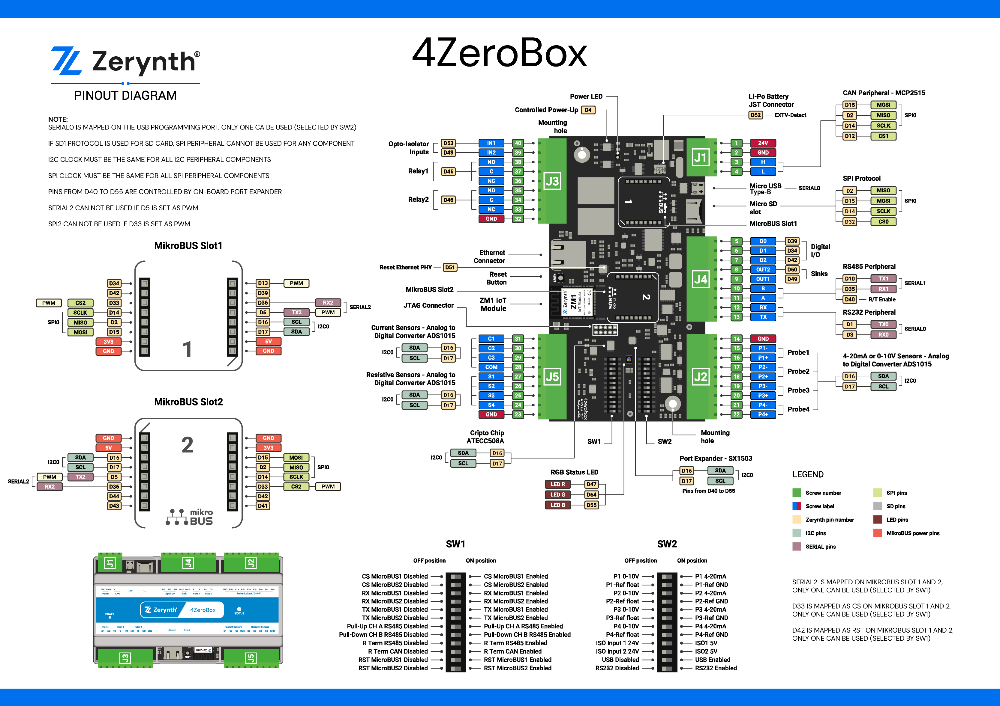

# 4ZeroBox

The 4ZeroBox is a modular hardware electronic unit that simplifies the development of Industrial IoT applications allowing rapid integration with sensors, actuators, and Cloud services.

4ZeroBox mounts a powerful ZM1 module by Zerynth (240MHz, 16Mb of Flash, 312Kb SRAM) and provides many onboard features like: a DIN-rail mountable case with industrial grade sensor channels, support for Wi-fi, Bluetooth, Ethernet, LoRa, CAN, RS485, RS232, SD Card, JTAG, I2C, SPI; last but not least, there are 2 on-board MikroBUS sockets to extend the 4ZeroBox with hundreds of MikroElektronika click boards (see “MikroBus Slots” section).

## Device Summary

* DIN-rail mountable (9 slots)
    
* 8 to 36V Power Supply
    
* 4 selectable analog input channels:
    
    -   4-20mA single-ended
    -   4-20mA differential
    -   0-10V standard
    
* 3 current transformers (non-invasive)
    
* 4 resistive sensor channels (NTC, RTD, contact, proximity, etc.)
    
* 2 opto-isolated digital inputs
    
* 2 sink digital output (60A @ 30V)
    
* MicroSD card slot
    
* 1 Digital I/O + 2 Digital Input (3.3V)
    
* 2 NO/NC Relay (10A @ 250V AC)
    
* CAN peripheral
    
* Connectivity:
    
    -   WiFi IEEE 802.11 b/g/n/e/i (Client and AP mode supported)
    -   Bluetooth® Low-Energy
    -   Ethernet
    
* Crypto Chip - Secure Hardware Encryption
    
* RS-485 and RS232 peripherals
    
* 2 onboard mikroBUS sockets
    
* Li-Po battery support
    
* Li-Po battery onboard charging unit
    
* RGB status led
    
* Espressif ESP32 - 32bit Microcontroller 240MHz clock, 4Mb of Flash, 312Kb SRAM
    

## Resources

For more infos about electrical connections, and how to use 4ZeroBox with sensors and other hardware, see the  [user manual](https://www.zerynth.com/download/13894/).

For more information on the 4ZeroBox Library as software drivers, Its features, functions and examples
[Please check this Link](../../reference/reference/bsp/4zerobox_v9/)

Other useful documents are:

-   [Datasheet](https://www.zerynth.com/download/13895/)
-   [Quick Guide](https://www.zerynth.com/download/15283/)

	

## Pin Mapping

Official reference for Zerynth 4ZeroBox can be found  [here](https://www.zerynth.com/4zeroplatform/).

## Getting Started

For step-by-step guide on connecting, running your first example, Please refer to [the Getting started guide for the 4ZeroBox](../../gettingstarted/4ZeroBox/)

## 4ZeroBox Software Library

For more information on the ZM1-DB Library as software Library, Its features, functions and examples demos
[Please check this Link](../../reference/reference/bsp/4zerobox_v9/)

## Power

Power to the 4ZeroBox is supplied via the on-board USB Micro B connector or directly via the “24V” screw. The power source is selected automatically. Zerynth 4ZeroBox has also a JST Li-Po battery connector (3.7V).

## Flash Layout

The internal flash of the ESP32 module is organized in a single flash area with pages of 4096 bytes each. The flash starts at address 0x00000, but many areas are reserved for Esp32 IDF SDK and Zerynth OS. There exist two different layouts based on the presence of BLE support.

| Start address | Size  | Content                 |
|---------------|-------|-------------------------|
| 0x0000A000    | 20Kb  | Esp32 NVS area          |
| 0x0000F000    | 4Kb   | Esp32 PHY data          |
| 0x00010000    | 2Mb   | Zerynth OS              |
| 0x00210000    | 1Mb   | Zerynth Bytecode        |
| 0x00310000    | 3Mb   | Zerynth OTA             |
| 0x00920000    | 7040Kb| File System             |

