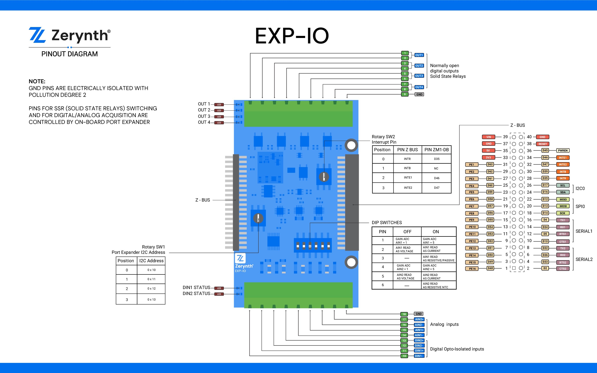

# **EXP-IO**

The EXP-IO expansion board is a mixed input/output module that features:

* **Relay**: The board features 4 Solid state relays Normally open connection rated at 36Vdc, This enables developers to control actuators easily using Software libraries with Zerynth SDK.
* **Opto-isolated digital inputs**: 2 channels of opto-isolated digital inputs are available on the board.
* **2 Analog Channels channels**: Connect your sensor easily and read the data from the sensors over the 2 industrial-compatible channels on the board. The channels support voltage-based ( ±10V), current-based (±20mA) or resistive sensors (calibrated for 11 Kohm for best precision).

<figure>
  
</figure>

## **Device Summary**

* **4x Solid State Relays** NO.
    Uses the TLP172A, Rated at 36Vdc.
* **2 opto-isolated digital inputs**
    Uses ISO1212DBQR IC rated for 36Vdc.
* **2 Analog Channels channels** Can be configured as
    4-20 mA Current channel
    0-10V Voltage channel
    Resistive Sensor Channel (calibrated for 11 Kohm for best precision).
    Current Clamp channel.

## **Resources and Documents**

-   [User manual](https://www.zerynth.com/download/13895/)

## **ZM1-DB Software Library**

For more information on the EXP-IO Library as software Library, features, functions and examples
[Please check this Link](../../reference/reference/bsp/zm1_db/)

## **Pin Mapping**

## **Rotart and Standard switches**

For information on the switches and other hardware details, Please refer to the [User manual of the board](#resources-and-documents)

## **Power**

Power to the EXP-IO is supplied directly by the ZM1-DB.

## **Z-Bus**

The modular expansion system uses the Z-Bus. The Z-Bus is an efficient, powerful standard for connecting and prototyping different sensors and devices.
The Z-Bus is using the CN1 pin header (20x2) exposing the following:

* 16 GPIO pins.
* 4 interrupt pins.
* 2 USART/UART instances with full support (TX,RX,RTS,CTS)
* I2C, SPI support.
* 5V, 3.3 V output pins.
* Enable pin for controlling the power to attached expansion boards.

!!! note 
    The development boards support up to 3 attached expansion boards.

<figure>
  
</figure>

Expansion boards vary in features and functionality. Currently, Zerynth offers expansion boards for :

* [EXP-IO](EXP-IO.md): Industrial input/output board with 4 solid-state relays, 2 analog channels (4-20mA/0-10V/NTC/current clamp) channels, 2 opto-isolated digital inputs
* [EXP-RELAY](EXP-RELAY.md): Relay board with 6 Electromechanical power relays rated 6A 250VAC.
* [EXP-SER](EXP-SER.md): Serial Communication board with : CAN, RS232 and RS485  interfaces.
* [EXP-PROTO](EXP-PROTO.md): Prototyping board for connecting and testing different types of sensors and devices.
